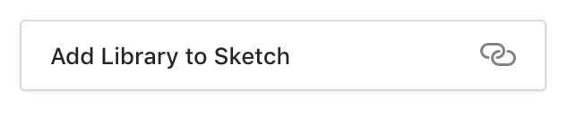

# Red Hat Marketing Icons Library
The Red Hat Marketing Icons Library provides all the Red Hat marketing icons from the Brand team in a single [Sketch](https://www.sketchapp.com/) library. This makes it easier for designers to browse and place the marketing icons in their designs.

### The icon library includes:

* Sketch symbols for all of the latest marketing icons
* Harveyball loading icons for 0-100 percentage
* Social media icons

## Downloading the Library
* Browse to the [Marketing Icons Library](https://www.sketch.com/s/bf415b2d-f138-445a-aa94-3f6ec20d3857) on Sketch Cloud
* Click on the *Add library to Sketch* button 

## Updating the library when new changes are available
Sketch will automatically receive library updates in the top, right corner of an open Sketch file. You'll want to update the Marketing Icon library **and** update the symbols within your file (two separate notifications). You'll have to update **all** files that are using the icon symbols - it is not a one and done process, unfortunately.

 

Please check out our [announcements](https://github.com/rh-uxd/marketing-icons/blob/master/announcements.md) for specific design kit release updates!

## Using the Library
Please review the [brand guidelines](https://docs.google.com/presentation/d/1hWN_blHI16nvj8ZoOF9E34d40rgpjeiWjNgZ4TB8JzY/edit) for icons and imagery. For more information about the brand assets and guidelines, visit the [Brand Mojo page](https://mojo.redhat.com/groups/brand-communities).

### Colors:
* Please use monochromatic colors for social media icons to comply with brand guidelines for those companies. Full color icons may be used in certain cases but monochromatic is the safe way to go.
* Four colors are available for marketing icons.
  * Red Hat red
  * PatternFly blue
  * White
  * Black

## Filing bugs
If something isn't working as expected with the library, please file an issue in this repo and label it with "bug". We should be able to fix it within a couple days!

## Release notes
To check out the latest design kit release notes, go [here](https://github.com/rh-uxd/marketing-icons/blob/master/release-notes.md).

Please check out our [announcements](https://github.com/rh-uxd/marketing-icons/blob/master/announcements.md) for specific design kit release updates!

## Contributing to the icon library
We welcome contributions from our community of Red Hat designers.

Please contact [brand@redhat.com](mailto:brand@redhat.com) for new icon designs ideas or icon requests.  

To add existing or newly created marketing icons to the library, contact Ashton Watkins [awatkins@redhat.com](mailto:awatkins@redhat.com) or @awatkins-rh in Github.

### Contributing a new icon or updating icons to the library
Follow these steps:
1. Get the design(s) approved by the [brand team](mailto:brand@redhat.com)
1. Download the library file from [here](https://www.sketch.com/s/bf415b2d-f138-445a-aa94-3f6ec20d3857)
1. Make certain that the strokes and fills used in the design are expanded and merged to form shapes that can have layers styles applied to them. You may need to join or subtract paths to get the intended result.
2. Add the new icon to the appropriate artboard or create a new artboard according to how it is organized by the brand team.
3. Make certain the icon fits into the 60 x 40 pixel grid nicely with the other icons.
4. When naming a new symbol, follow the naming mechanism within that same category (ex. 01_Hardware / Tablet / Tablet_outline)
5. Apply the layer style for colors to the icon. Black is the default color.
6. Make it clear which page in the file you edited and which symbols on the page you added/edited by adding a ⭐️ or some other mark to call them out.
7. Zip your file and attach it to the Github issue you were assigned to. Add a list of the symbols you added/edited. And finally, tag @awatkins-rh in your comment.

### Questions?
If you have any questions or concerns, please contact Ashton Watkins [awatkins@redhat.com](mailto:awatkins@redhat.com).
